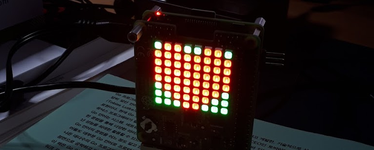

# matrix
  
A toy project to drive Sense Hat's LED matrix by using Go/JS.



## Description

This project consists of 2 parts:
- A simple mobile front-end based on P5 that can modify the matrix data for 64 LEDs on Sense Hat.
- Golang based web server with REST APIs that accepts the configuration from the front-end and controls the LEDs via I2C.

An image can make more sense than the description above.


- The simple mobile web front-end has 64 dots that represent the 64 LEDs on Sense Hat. 
- Users can choose which LEDs they want to control for the color with the 3 buttons such as All, Partial, and Single. 
- The colors can be changed by the 3 sliders as well as the buttons below that can flip and turn the matrix. 
- Lastly, there is an Apply button that sends the data to the RPI server (then the Go app takes the data and controls Sense Hat via I2C).

Here is a link to Youtube that shows its actual behavior.  
[https://youtu.be/xrmaou6DVRc](https://youtu.be/xrmaou6DVRc)

The readers can try this project with their RPI and Sense Hat.

## Materials

### Hardware

To properly reproduce this project, readers should have these hardwares:
- A host PC that has software to build this project
- A Raspberry Pi with a micro SD card that has more than 8 GB to store Raspbian stretch
- A Sense Hat
- Cables for power, network, and serial terminal

### Software

The PC should have these tools:
- Go SDK (1.12 is the latest official version as of March 2019)
- VSCODE (+ Go and SFTP extensions)
- Web Browser (Chrome/Chromium)
- SSH/SFTP client
- Git client
- Should be connected to your router

The RPI should have these tools:
- OpenSSH server that has port opened as you want (not 22 though...)
- Should be connected to your router (Please note the IP address)

### Steps to follow

#### 1. clone this repo  
  
First, clone this repo to the host.  
Typically you can use the git command in Linux/Mac.  
  
```
git clone https://github.com/bus710/matrix
``` 
  
#### 2. open the project cloned 
  
Open this repo with VSCODE.  
  
```
code $PROJECT-ROOT/server
```

#### 3. build the Go server for ARM processor

Assumingly the host has Go SDK and ready to build this repo.  
If so, press **CTRL + SHIFT + B**, then VSCODE will show you a dialog to build for x64 or ARM (Please pick matrixARM).

#### 4. Config SFTP extension (liximomo)  
  
To push the matrixARM binary and the web contents files, a file (server/.vscode/sftp.json) should be generated (CTRL+SHIFT+P) and changed to point the RPI's IP address.

```
{
    "name": "upload to rpi",
    "host": "192.168.1.76",
    "protocol": "sftp",
    "port": 2222,
    "username": "pi",
    "remotePath": "/home/pi/",
    "uploadOnSave": false,
    "privateKeyPath": "~/.ssh/test",
    "passive": false,
    "interactiveAuth": false,
    "syncMode": "update"
}
```  
  
The host and port should be updated regarding the RPI.

#### 5. Generate a SSH key and push it to RPI

The host and RPI should share a SSH key to use the SFTP extension.  
  
```
ssh-keygen -t rsa -b 2048 -v
ssh-copy-id -i .ssh/test pi@192.168.1.76 -p 2222
ssh -p 2222 pi@192.168.1.76
```

If the key was well copied into RPI, the last command makes your terminal to log in to RPI without password.

#### 6. Push the binary and web contents to RPI

From VSCODE, 
- righ-click the matrixARM generated from the file explorer and click **Upload**.  
- Repeat the same action for the public directory.

#### 7. Run the Go server from RPI

From RPI's terminal, run below commands:  
  
```
chmod 744 matrixARM
./matrixARM
```

#### 8. Access RPI from Web brower of the host

From Web browser, access to http://192.168.1.76:8080.  
(Pleae note that the address should be changed as your case).

#### 9. Play with the app!
  
If you see a screen from your browser as same as the image example in the beginning, you are ready to play with that, enjoy!

  
## Writer

- SJ Kim - <bus710@gmail.com>


----
**Disclaimer**  
  
```
This is just a toy project that cannot be used for safety/commercial products.   
The developer doesn't take any kind of (phsical, mental, and financial) responsibility. 
```
