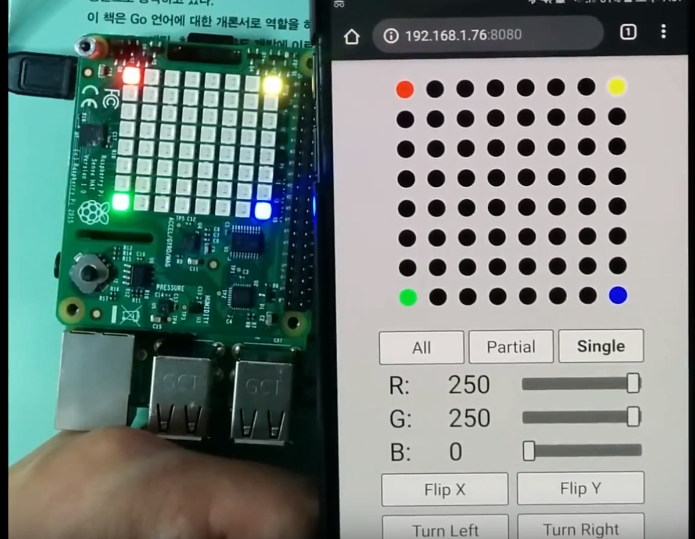

# matrix

## Writer

- SJ Kim - <bus710@gmail.com>

## Description

A toy project to drive Sense Hat's matrix by using Go (http, gorilla, and Periph) and P5.js.

This project consists of 2 parts:
- A simple mobile front-end based on P5 that can give a simple web GUI to control 64 LEDs on Sense Hat.
- Golang based web server with REST APIs that accepts the configuration from the front-end and control the LEDs via I2C.

An image can make more sense than the description.



The simple mobile web front-end has 64 dots that represent the 64 LEDs on Sense Hat. Users can chose which LEDs they want to change with the 3 buttons such as All, Partial, and Single. The colors can be changed by the 3 sliders as well as the buttons below that can flip and turn the matrix. Lastly, there is an Apply button that sends the data to the RPI server.

Here is a link to Youtube that shows the actual behavior.  
[https://youtu.be/xrmaou6DVRc](https://youtu.be/xrmaou6DVRc)

The readers can try this project with their RPI and Sense Hat.

**Disclaimer**
```
This is just a toy project that cannot be used for safety/commercial products. The developer doesn't take any kind of (phsical, mental, and financial) responsibility. 
```

## Materials

### Hardware

To properly reproduce this project, readers should have these hardwares:
- A PC that has software to build this project
- A Raspberry Pi with a micro SD card that has more than 8 GB to store Raspbian stretch
- A Sense Hat
- Cables for power, network, and serial terminal

### Software

The PC should have these tools:
- Go SDK (1.12 is the latest official version as of March 2019)
- VSCODE (+ Go and SFTP extensions)
- Web Browser (Chrome/Chromium)
- SSH/SFTP client
- Git client
- Should be connected to your router

The RPI should have these tools:
- OpenSSH server that has port opened as you want (not 22 though...)
- Should be connected to your router (note the IP address)

